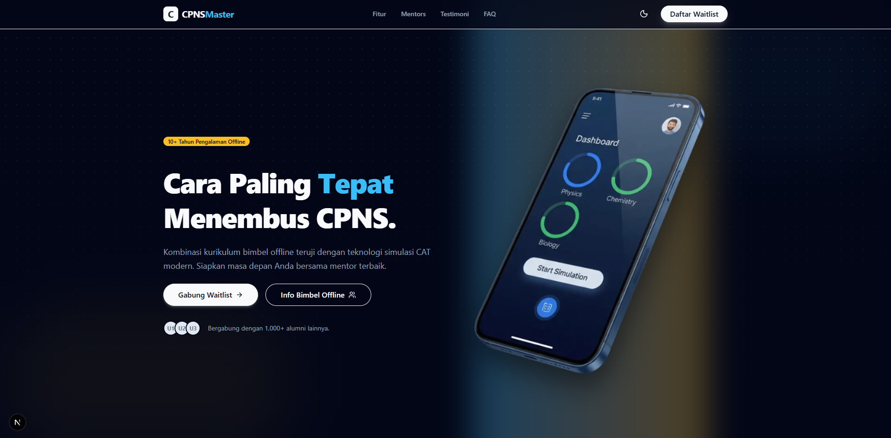

# 🎓 CPNS Master Landing Page

A premium, high-conversion landing page designed for **CPNS Master** — an integrated CPNS preparation platform combining offline tutoring with a modern mobile app.



## ✨ Overview

This project is a modern landing page built to showcase the features of the CPNS Master ecosystem. It highlights the value proposition of the platform, including its specialized offline classes and the upcoming mobile application featuring Smart Notifications and Streak systems.

The design focuses on **credibility**, **aesthetic appeal**, and **conversion optimization** (Waitlist generation).

## 🚀 Key Features

*   **⚡ Modern & Premium UI**: Built with a sleek, glassmorphism-inspired design system using Tailwind CSS.
*   **🌓 Dark Mode Support**: Fully responsive dark mode with robust theme switching infrastructure.
*   **📱 Fully Responsive**: Optimized for all devices, from mobile phones to large desktop screens.
*   **✨ Interactive Animations**: Smooth scroll animations, floating elements, and transitions powered by Framer Motion.
*   **🔥 Feature Showcase**: Interactive components demonstrating App features like "Streak" and "Smart Notifications".
*   **❓ FAQ Accordion**: Clean, collapsible FAQ section built with Radix UI primitives.
*   **👆 Refined UX**: Custom scrollbars, pointer cursors on interactive elements, and smooth scroll navigation.

## 🛠️ Tech Stack

*   **Framework**: [Next.js 14+](https://nextjs.org/) (App Router)
*   **Styling**: [Tailwind CSS](https://tailwindcss.com/)
*   **Animations**: [Framer Motion](https://www.framer.com/motion/)
*   **Icons**: [Lucide React](https://lucide.dev/)
*   **Components**: [Radix UI](https://www.radix-ui.com/) (Accordion, etc.)
*   **Deployment**: Vercel Ready

## 📂 Project Structure

```bash
src/
├── app/               # Next.js App Router pages and layouts
├── components/
│   ├── layout/        # Navbar, Footer
│   ├── sections/      # Hero, Features, Mentors, FAQ, etc.
│   └── ui/            # Reusable UI components (Button, Container, etc.)
└── lib/               # Utilities (clsx, twMerge)
```

## 🏃‍♂️ Getting Started

1.  **Clone the repository**
    ```bash
    git clone https://github.com/8shagrid/cpns-landing.git
    cd cpns-landing
    ```

2.  **Install dependencies**
    ```bash
    npm install
    ```

3.  **Run the development server**
    ```bash
    npm run dev
    ```

4.  Open [http://localhost:3000](http://localhost:3000) with your browser to see the result.

## 🚢 Deployment

This project is optimized for deployment on **Vercel**.

1.  Push your code to GitHub.
2.  Import the repository in Vercel.
3.  Deploy! (No complex configuration required).

## 📄 License

&copy; 2024 CPNS Master. All rights reserved.
